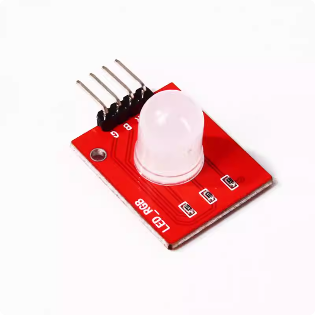
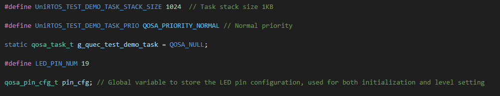
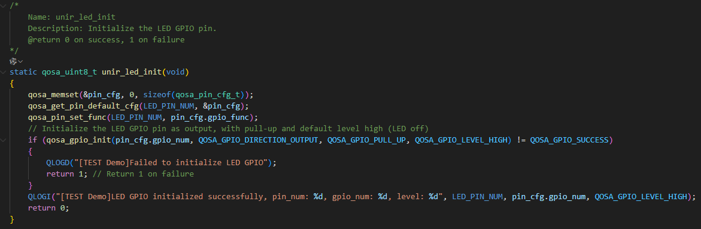
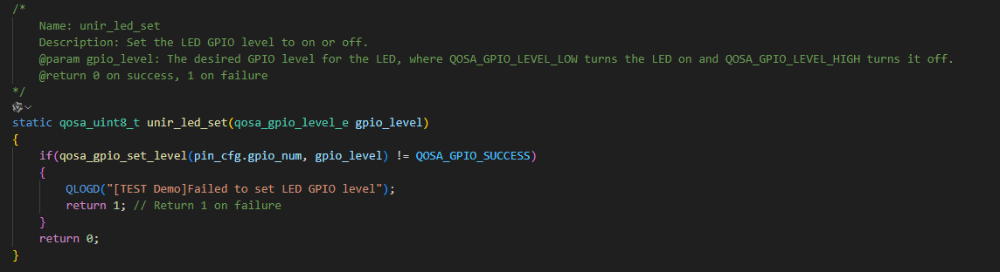
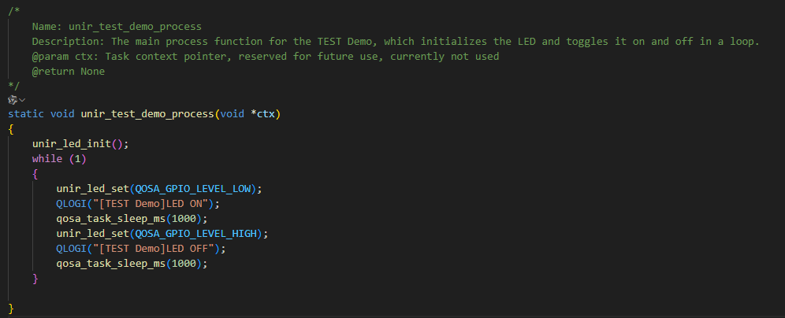
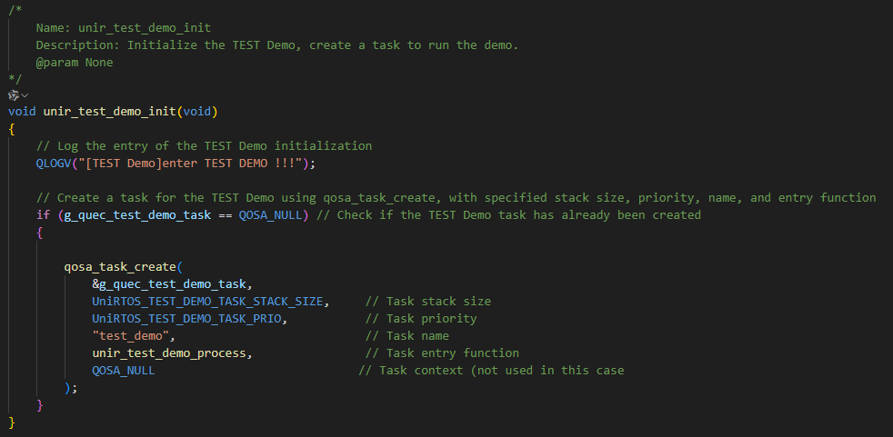

# UniRTOS ：使用GPIO驱动LED灯

本项目基于移远EG800Z-CN开发板实现LED驱动功能，是面向物联网创客的入门级实操案例, 可直接获取调试。

## 实现原理

配置引脚为GPIO功能，将GPIO配置成上拉输出模式，通过不断改变输出电平，控制LED灯的亮灭状态，从而实现LED灯闪烁效果、

通过该案例可以了解到：

- UniRTOS中如何配置引脚对应的GPIO功能？
- UniRTOS中如何在程序运行过程改变GPIO的输出电平？

## 复现步骤

就像“hello world”是学习编程语言的第一步，“驱动GPIO”同样是嵌入式的第一步。下面跟着步骤走，一起使用UniRTOS实现驱动GPIO

### 硬件清单

| **硬件名称**    | **数量** | **实物图**                                                   | **获取链接**                                                 |
| --------------- | -------- | ------------------------------------------------------------ | ------------------------------------------------------------ |
| EG800Z-CN开发板 | 1        |  | [点此获取](https://www.quecmall.com/goods-detail/2c90800b987f06090198aca7bde100a6) |
| LED灯           | 1        |  | [点此获取](https://detail.tmall.com/item.htm?ali_refid=a3_430673_1006%3A2725910787%3AH%3AemC90G13pUSuB8Pt8hMAUId0GITpZeCJ%3A1760e9ad887fa12c8fb7a7a83a1d313c&ali_trackid=282_1760e9ad887fa12c8fb7a7a83a1d313c&id=1033788880165&loginBonus=1&mi_id=0000h8U_I-LIDhvaCCMPitGKfdFTLtJ6OW_RV6zAjoPhDLo&mm_sceneid=1_0_9988748269_0&priceTId=214783fc17750970043576732e1379&spm=a21n57.sem.item.5&utparam={"aplus_abtest"%3A"d8d90ce0cc494e0764573147420cca92"}&xxc=ad_ztc) |
| USB数据线       | 1        |  | [点此获取](https://detail.tmall.com/item.htm?abbucket=11&id=712043397690&mi_id=0000UuATUkl2Swill--d8ar3-R828dAfvrmApTj3VzPdxhA&ns=1&priceTId=214783fc17750971433067563e1379&skuId=5825460040081&spm=a21n57.1.hoverItem.4&utparam={"aplus_abtest"%3A"d39c694c59ac1c7b55f24ab87fd2bb30"}&xxc=taobaoSearch) |

### 软件准备

| **软件名称** | **描述**                           | **获取链接**                                                 |
| ------------ | ---------------------------------- | ------------------------------------------------------------ |
| USB驱动      | Quectel_Windows_USB_DriverY_V1.0.2 | [点此获取](https://www.quectel.com.cn/download/quectel_windows_usb_drivery_v1-0_cn) |
| UniRTOS SDK  | C-SDK                              |                                                              |
| EPAT         | 移芯平台日志调试工具               | [点此获取](https://www.quectel.com.cn/download/epat日志工具) |

### 固件编译和烧录

CSDK新增Demo，固件编译和烧录请参考UniRTOS板块的**快速启动栏**

## 实现讲解

### 常量定义 ：

1. 定义线程栈大小为1024字节，即1 kb
2. 定义线程优先级为一般优先级
3. 定义线程任务句柄，初始化为空
4. 定义需要初始化的引脚号，*Demo*中使用19号引脚，如需其他引脚，请自行修改
5. 定义一个 `pin_cfg`，用于后续接收默认引脚配置，类型为`qosa_pin_cfg_t`

	

### *unir_led_init* 函数

主要功能是初始化引脚对应的GPIO功能

1. 使用`qosa_memset`现将`pin_cfg`中的成员初始化为0
2. 使用`qosa_get_pin_default_cfg`获取引脚的默认配置，拿到引脚对应GPIO号，GPIO功能配置
3. 使用`qosa_set_func`设置当前引脚功能为GPIO功能，此处的GPIO功能配置值由上一步获取
4. 使用`qosa_gpio_init`初始化GPIO功能，配置为上拉输出模式，默认电平高电平

### *unir_led_set*函数

主要功能：改变引脚的GPIO输出电平，从而实现LED的亮灭

### *unir_test_demo_process* 函数

主要功能：线程处理函数，主要实现LED的闪烁逻辑，每隔1s改变GPIO的输出电平

​	

### *unir_test_demo_init* 函数

主要功能：调用函数初始化配置GPIO，创建线程执行任务

​	

## 常见问题

### 1. LED没有任何反应？

检查连线是否正确，确认GPIO配置为输出模式，引脚配置为GPIO功能

### 2. 是否可以使用其他引脚？

修改开头的宏定义LED_PIN_NUM即可更换为其他引脚