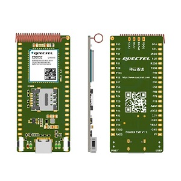
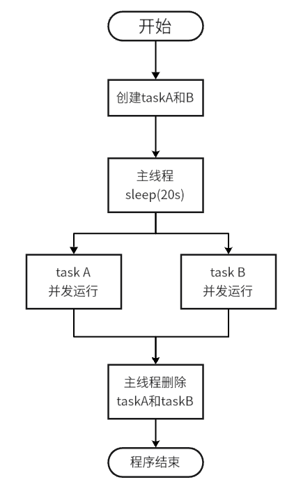
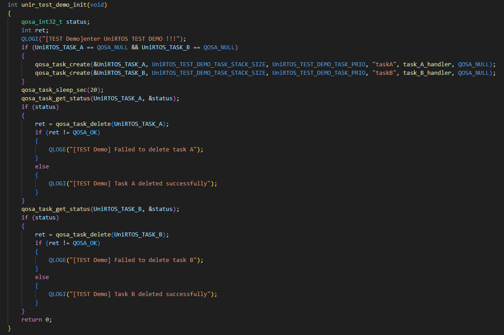

# 【EG800Z-CN】多线程示例

## 项目概述

本案例使用移远通信EG800Z-CN开发板和UniRTOS，实现了一个简单的多线程并发程序，创建两个线程，分别打印不同的内容，展示多任务“同时”执行的效果。

### 功能特性

**基于多线程的并发任务执行**

- **独立线程并发运行**：创建两个独立的任务线程，实现不同内容的并行打印输出，互不干扰。
- **差异化任务处理**：每个线程执行专属的打印逻辑，可输出自定义的、具有区分度的信息流。
- **纯软件调度**：完全依赖RTOS的软件线程调度机制，无需专用硬件加速。

​	

## 开发准备

### 硬件要求

| **硬件名称**    | **数量** | **实物图**                                             | **获取链接**                                                 |
| --------------- | -------- | ------------------------------------------------------ | ------------------------------------------------------------ |
| EG800Z-CN开发板 | 1        |        | [点此获取](https://www.quecmall.com/goods-detail/2c90800b987f06090198aca7bde100a6) |
| USB数据线       | 1        |  | [点此获取](https://detail.tmall.com/item.htm?abbucket=11&id=712043397690&mi_id=0000UuATUkl2Swill--d8ar3-R828dAfvrmApTj3VzPdxhA&ns=1&priceTId=214783fc17750971433067563e1379&skuId=5825460040081&spm=a21n57.1.hoverItem.4&utparam={"aplus_abtest"%3A"d39c694c59ac1c7b55f24ab87fd2bb30"}&xxc=taobaoSearch) |

### 软件要求

| **软件名称**    | **描述**                           | **获取链接**                                                 |
| --------------- | ---------------------------------- | ------------------------------------------------------------ |
| Quectel USB驱动 | Quectel_Windows_USB_DriverY_V1.0.2 | [点此获取](https://www.quectel.com.cn/download/quectel_windows_usb_drivery_v1-0_cn) |
| UniRTOS SDK     | C-SDK                              |                                                              |
| EPAT            | 移芯平台日志调试工具               | [点此获取](https://www.quectel.com.cn/download/epat日志工具) |

## 快速上手

### 下载项目

示例代码位于UniRTOS 官方创客仓库，**点此访问下载**

### 添加项目到UniRTOS SDK

CSDK新增Demo，固件编译和烧录请参考UniRTOS板块的**快速启动栏**

### 硬件连接

使用USB数据线连接开发板和电脑即可

### 效果展示

可查看media目录下的.mp4格式视频查看实际效果

## 代码概览

### 示例工作流程

​	

### 主要功能接口

- `unir_test_demo_init` 函数

  - **功能**:程序入口，创建两个线程

  - 关键操作: 
    - 创建任务：调用`qosa_task_create` 创建task A 和task B
    - 删除任务：调用`qosa_task_delete` 创建task A 和task B

​	

### 其他接口

如有其他需求，如挂起线程，终止线程等，参考如下：

1. *qosa_task_suppend* : 挂起线程任务
2. qosa_task_resume : 恢复被挂起的线程任务
3. *qosa_task_get_current_ref* ：获取当前线程的任务句柄
4. *qosa_task_change_priority* ：改变线程的优先级
5. *qosa_task_get_priority* ： 获取线程的优先级