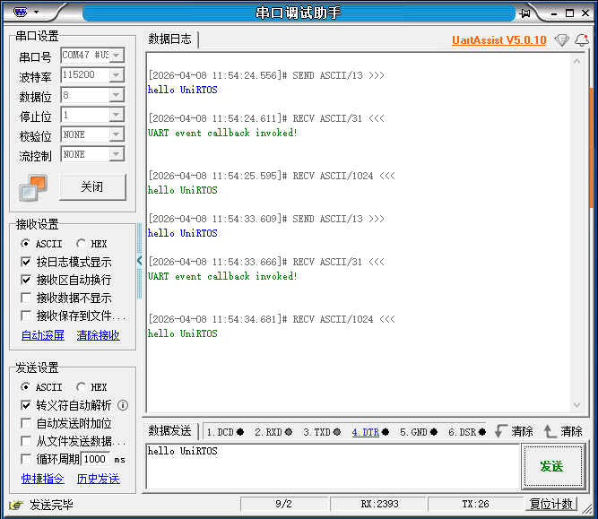
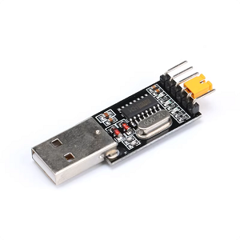
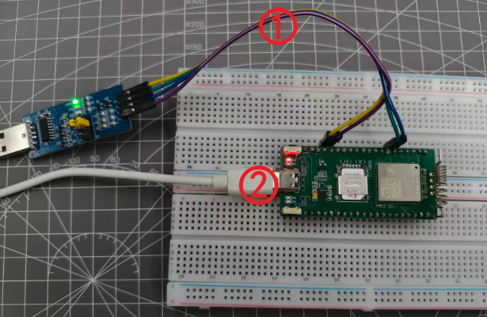
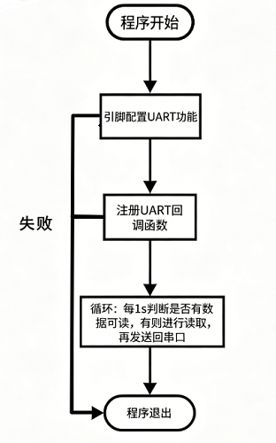

# 【EG800Z-CN】简单的UART通信回显功能

## 项目概述

这是一个基础的UART通信协议应用，适合新手和初学者了解UART的应用。本案例使用移远通信EG800Z-CN开发板和UniRTOS，通过调用UART相关功能函数，实现了一个串口通信回显功能，串口工具向开发板发送的任何内容，开发板都会发送回给串口工具，达到“回显”效果。

## 功能特性

**基于UART的实时数据回显**

- **全双工实时通信**：利用通用异步收发器（UART）实现数据的同步接收与发送，确保通信链路畅通无阻。
- **精准字节级回显**：对接收到的每一个字节数据进行即时、原样返回，实现1:1的精确回显，便于通信链路验证与调试。
- **支持连续数据流**：能够稳定处理来自上位机或外部设备的连续、高速数据流，并保持低延迟的回显响应。

​	

## 开发准备

### 硬件要求

| **硬件名称**       | **数量** | **实物图**                                             | **获取链接**                                                 |
| ------------------ | -------- | ------------------------------------------------------ | ------------------------------------------------------------ |
| EG800Z-CN开发板    | 1        |        | [点此获取](https://www.quecmall.com/goods-detail/2c90800b987f06090198aca7bde100a6) |
| USB转TTL CH340模块 | 1        |            | [点此获取](https://item.taobao.com/item.htm?ali_refid=a3_430673_1006%3A1121464922%3AH%3AACMF3R2mJsla45tNgCvtiQ%3D%3D%3Aaa3d37a85eaf985ceb913c7929f88342&ali_trackid=318_aa3d37a85eaf985ceb913c7929f88342&id=522571378803&loginBonus=1&mi_id=0000Hqlvbw9WBQxv2Q7LBGKvWoqh_AyMM-yCsT3vnVrF0SY&mm_sceneid=0_0_111680763_0&priceTId=2147845317756178702896957e11bf&spm=a21n57.sem.item.5&utparam={"aplus_abtest"%3A"e0944e0c3933579b34a15cc5e0d0bd96"}&xxc=ad_ztc) |
| USB数据线          | 1        |  | [点此获取](https://detail.tmall.com/item.htm?abbucket=11&id=712043397690&mi_id=0000UuATUkl2Swill--d8ar3-R828dAfvrmApTj3VzPdxhA&ns=1&priceTId=214783fc17750971433067563e1379&skuId=5825460040081&spm=a21n57.1.hoverItem.4&utparam={"aplus_abtest"%3A"d39c694c59ac1c7b55f24ab87fd2bb30"}&xxc=taobaoSearch) |

### 软件要求

| **软件名称**    | **描述**                           | **获取链接**                                                 |
| --------------- | ---------------------------------- | ------------------------------------------------------------ |
| Quectel USB驱动 | Quectel_Windows_USB_DriverY_V1.0.2 | [点此获取](https://www.quectel.com.cn/download/quectel_windows_usb_drivery_v1-0_cn) |
| UniRTOS SDK     | C-SDK                              |                                                              |
| EPAT            | 移芯平台日志调试工具               | [点此获取](https://www.quectel.com.cn/download/epat日志工具) |
| CH340驱动       | USB转TTL模块驱动                   | [点此获取](https://sparks.gogo.co.nz/assets/_site_/downloads/CH34x_Install_Windows_v3_4.zip) |

## 快速上手

### 添加项目到UniRTOS SDK

CSDK新增Demo，固件编译和烧录请参考UniRTOS板块的**快速启动**

### 硬件连接

​	

1. 使用杜邦线连接usb-ttl模块和开发板的UART0，VCC->3V3 , GND->GND , TX-> RX0 , RX->TX0
2. 使用USB数据线连接开发板和电脑

### 效果展示

下图为串口工具发送和接收的数据

​	

## 代码概览

### 示例工作流程

​	

### 主要功能接口

#### *unir_test_demo_init -* 入口与初始化函数

- **功能**: 这是整个 UART 演示功能的**入口点**。它的主要职责是创建并启动一个独立的任务（线程），让 UART 的具体逻辑在后台运行，而不阻塞主程序。
- 关键操作:
  - **任务创建**: 调用`qosa_task_create`来创建一个名为 `uart_demo` 的新任务。这个新任务将执行`unir_uart_demo_process`函数。
- **重要性**: 这是用户需要在自己的应用初始化流程中调用的函数，以启动 UART 功能。

#### *unir_uart_demo_process* - UART 主处理函数

- **功能**: 这是 UART 演示的**核心逻辑**所在。它在一个无限循环中运行，负责完成 UART 的所有配置、初始化和数据轮询工作。
- 关键操作:
  - **注册回调**: 通过 `qosa_uart_register_cb` 将回调函数注册到 `UNIR_TEST_UART_PORT` 端口。这使得系统能在特定事件发生时自动通知我们。
  - **配置通信参数**: 设置波特率 (115200)、数据位 (8)、停止位 (1)、校验位 (无) 和流控 (无)。然后通过 `qosa_uart_ioctl`将这些配置应用到 UART 端口。
  - **配置引脚复用**: 使用 `qosa_pin_set_func` 将硬件引脚 `UNIR_TEST_UART_TX_PIN` 和 `UNIR_TEST_UART_RX_PIN` 设置为 UART 功能，而不是普通的 GPIO。
  - **打开端口**: 调用 `qosa_uart_open(UNIR_TEST_UART_PORT)` 正式打开 UART 端口，使其可以进行读写操作。
  - 主循环 (轮询): 
    1. **休眠**: `qosa_task_sleep_sec(1);` 让任务每秒检查一次，避免过度占用 CPU。
    2. **检查数据**: `qosa_uart_read_available(...)` 查询 UART 接收缓冲区是否有待读取的数据。
    3. **读取数据**: 如果有数据，则调用 `qosa_uart_read` 将数据读入全局缓冲区 `g_uart_data`。
    4. **回传数据**: 调用 `qosa_uart_write` 将刚刚读取到的数据原样发送回去（回显功能）。
    5. **清空缓冲区**: `qosa_memset` 清空缓冲区，为下一次接收做准备。
- **重要性**: 这个函数封装了 UART 从配置到使用的完整生命周期，是理解如何操作 UART 的关键。

## 常见问题

### 串口工具收发数据无任何反应？

检查开发板和usb-ttl模块的硬件连接，确认双方的TX是连接另一方的RX