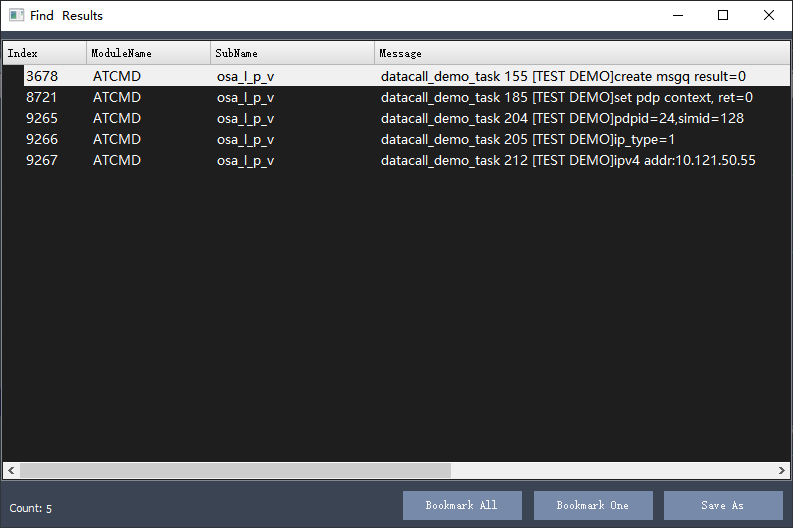
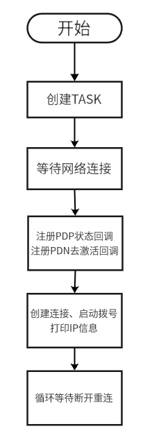

# 【EG800Z-CN】快速连接蜂窝网络

### 项目概述

本案例使用移远通信EG800Z-CN开发板和UniRTOS，通过调用UniRTOS中注网相关的功能函数，让开发板快速连接蜂窝网络，获取IP地址。

### 现象演示

查看本目录下media文件夹中格式为.mp4的视频

### 开发准备

#### 硬件要求

- EG800Z-CN开发板，[点此购买开发板](https://www.quecmall.com/goods-detail/2c90800b987f06090198aca7bde100a6)

​	

- USB数据线（TYPE-C），[点此购买](https://detail.tmall.com/item.htm?abbucket=11&id=712043397690&mi_id=0000UuATUkl2Swill--d8ar3-R828dAfvrmApTj3VzPdxhA&ns=1&priceTId=214783fc17750971433067563e1379&skuId=5825460040081&spm=a21n57.1.hoverItem.4&utparam={"aplus_abtest"%3A"d39c694c59ac1c7b55f24ab87fd2bb30"}&xxc=taobaoSearch)

​	)

- 有效SIM卡（可发短信）

​	

#### 软件要求

- Quectel USB驱动，[点此获取](https://www.quectel.com.cn/download/quectel_windows_usb_drivery_v1-0_cn)
- UniRTOS SDK，获取请联系[技术与支持](https://www.quectel.com.cn/contact?tab=t)。
- EPAT工具：移芯平台日志调试工具，[点此获取](https://www.quectel.com.cn/download/epat日志工具)

### 快速上手

#### 下载项目

示例代码位于本案例`src`目录下

#### 添加项目到UniRTOS SDK

CSDK新增Demo，固件编译和烧录请参考UniRTOS板块的**快速启动栏**

#### 硬件连接

​	

1. 按卡槽丝印提示方向拨开卡槽盖，将SIM卡放入，再扣好盖子
2. 使用数据线连接开发板和电脑

#### 日志展示

​	

### 代码概览

#### 示例流程图

​	

#### 主要功能接口

##### unir_test_demo_init

**功能**：DataCall 拨号演示功能的入口与初始化函数。主要职责是创建并启动独立任务，让联网拨号逻辑在后台运行，不阻塞主程序。
**关键操作**：

- 任务创建：调用 **`qosa_task_create`** 创建名为QDATACALLDEMO的任务，执行`datacall_demo_task`函数。
- 任务配置：栈大小 4KB，使用普通优先级，保证联网流程稳定运行。
- **重要性**：用户需在应用初始化流程中调用，以启动 DataCall 自动拨号、联网、重连全套功能。

##### datacall_demo_task

**功能**：DataCall 演示核心主处理函数。在独立任务中完成网络附着、PDP 配置、拨号建立、IP 获取、掉线自动重连的全生命周期逻辑。
**关键操作**：

- 消息队列创建：用于接收网络事件，实现异步事件处理。
- 网络附着等待：调用`qosa_datacall_wait_attached`等待注网成功，超时 300 秒。
- 事件回调注册：注册 **PDN 断开**与 **PDP 状态变化**回调，监听网络状态。
- PDP 上下文配置：设置 APN、IP 类型（IPv4/IPv6），调用`qosa_datacall_set_pdp_context`。
- 创建并启动拨号：`qosa_datacall_conn_new` 创建连接，qosa_datacall_start执行同步拨号。
- 获取并打印 IP 信息：支持 IPv4/IPv6 地址解析与日志输出。
- 无限循环监听事件：等待消息队列，处理 PDP 断开事件并自动重拨。
- 掉线重连机制：最多重试 10 次，每次间隔 20 秒，重连成功后重新获取 IP。
- **重要性**：完整封装蜂窝数据拨号从上线到异常恢复的全套流程，是物联网设备联网的核心逻辑。

##### datacall_nw_deact_pdp_cb

**功能**：PDN 网络去激活（掉线）事件回调函数。当网络 / 基站主动断开 PDP 时被系统自动调用。
**关键操作**：

- 获取掉线信息：解析 simid,pdpid。
- 封装事件消息：通过消息队列发给主任务，触发重连流程。
- **重要性**：实现**掉线感知**，是自动重连机制的触发入口。

##### datacall_pdp_change_cb

**功能**：PDP 拨号状态变化回调函数。用于监听拨号激活 / 去激活状态上报。
**关键操作**：

- 接收 PDP 状态事件，可扩展用于状态监控、日志记录、上层通知等。
- **重要性**：用于实时监控拨号链路状态，便于调试与业务联动。