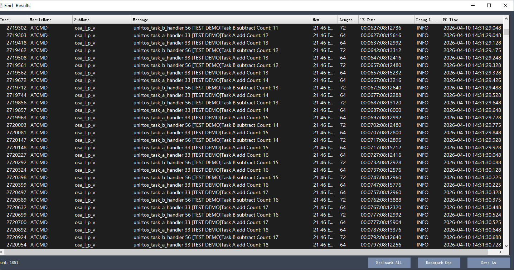
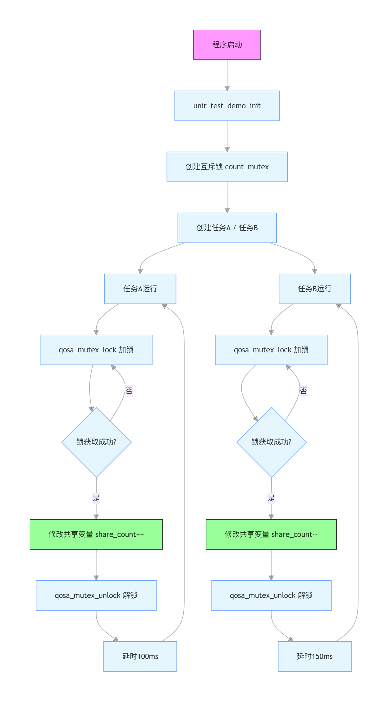

# 【EG800Z-CN】使用互斥锁访问共享资源

### 项目概述

这是一个简易的mutex应用示例，本案例使用移远通信EG800Z-CN开发板和UniRTOS，调用UniRTOS中Mutex相关功能函数编写。让两个任务访问同一共享资源，当访问资源时需获取mutex，确保同一时刻仅有一个任务能够进入受保护的临界区。

### 功能特性

**高可靠内核级互斥锁机制**

- **严格互斥访问控制**：确保同一时刻仅有一个任务或线程能够进入受保护的临界区，彻底杜绝多任务并发访问共享资源引发的数据竞争与状态不一致问题。
- **超时安全退出机制**：提供带超时参数的加锁接口（qosa_mutex_lock），若在指定时间内未能获取锁，则返回错误码，防止任务无限期挂起。

### 开发准备

#### 硬件要求

- EG800Z-CN开发板，[点此购买开发板](https://www.quecmall.com/goods-detail/2c90800b987f06090198aca7bde100a6)

​	

- USB数据线（TYPE-C），[点此购买](https://detail.tmall.com/item.htm?abbucket=11&id=712043397690&mi_id=0000UuATUkl2Swill--d8ar3-R828dAfvrmApTj3VzPdxhA&ns=1&priceTId=214783fc17750971433067563e1379&skuId=5825460040081&spm=a21n57.1.hoverItem.4&utparam={"aplus_abtest"%3A"d39c694c59ac1c7b55f24ab87fd2bb30"}&xxc=taobaoSearch)

​	

#### 软件要求

- Quectel USB驱动，[点此获取](https://www.quectel.com.cn/download/quectel_windows_usb_drivery_v1-0_cn)
- UniRTOS SDK，获取请联系[技术与支持](https://www.quectel.com.cn/contact?tab=t)。
- EPAT工具：移芯平台日志调试工具，[点此获取](https://www.quectel.com.cn/download/epat日志工具)

### 快速上手

#### 下载项目

示例代码位于本案例`src`目录下

#### 添加项目到UniRTOS SDK

CSDK新增Demo，固件编译和烧录请参考UniRTOS板块的**快速启动栏**

#### 硬件连接

使用数据线连接开发板和电脑即可

#### 效果展示

演示效果可查看当前目录下media文件夹中的.mp4视频，日志如图

​	

### 代码概览

#### 示例流程图

​	

#### 主要功能接口

##### unir_test_demo_init

**功能**：互斥锁演示功能的入口与初始化函数。主要职责是创建互斥锁，再启动两个独立任务，用于安全访问共享资源，不阻塞主程序。
**关键操作**：

- 创建互斥锁：调用 **qosa_mutex_create** 创建count_mutex，用于保护共享变量share_count。
- 任务创建：分别创建 **Task A** 和 **Task B** 两个任务，栈大小 4096，普通优先级。
- **重要性**：用户需在应用初始化时调用，完成互斥锁与任务的启动，是多任务资源保护的标准入口。

##### unirtos_task_a_handler

**功能**：互斥锁演示任务 A。循环对共享资源执行 **加 1** 操作，通过互斥锁保证原子性与线程安全。
**关键操作**：

- 申请互斥锁：**qosa_mutex_lock**，永久等待直到获取锁。
- 操作共享资源：对share_count执行+1。
- 释放互斥锁：**qosa_mutex_unlock**，让其他任务可以使用资源。
- 任务延时：**qosa_task_sleep_ms(100)** 模拟业务处理。
- **重要性**：展示**读 - 改 - 写**类共享资源如何安全加锁、解锁。

##### unirtos_task_b_handler

**功能**：互斥锁演示任务 B。循环对共享资源执行 **减 1** 操作，与任务 A 竞争同一把锁，验证互斥机制。
**关键操作**：

- 申请互斥锁：**qosa_mutex_lock**，永久等待直到获取锁。
- 操作共享资源：对share_count执行-1。
- 释放互斥锁：**qosa_mutex_unlock**。
- 任务延时：**qosa_task_sleep_ms(150)**，模拟业务处理。
- **重要性**：与任务 A 形成**竞争场景**，直观体现互斥锁防止多任务并发冲突的作用。