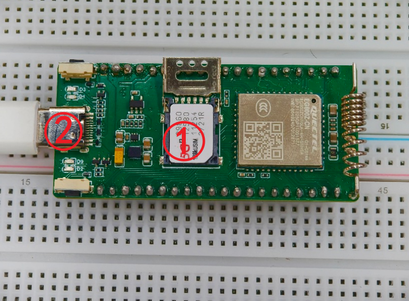
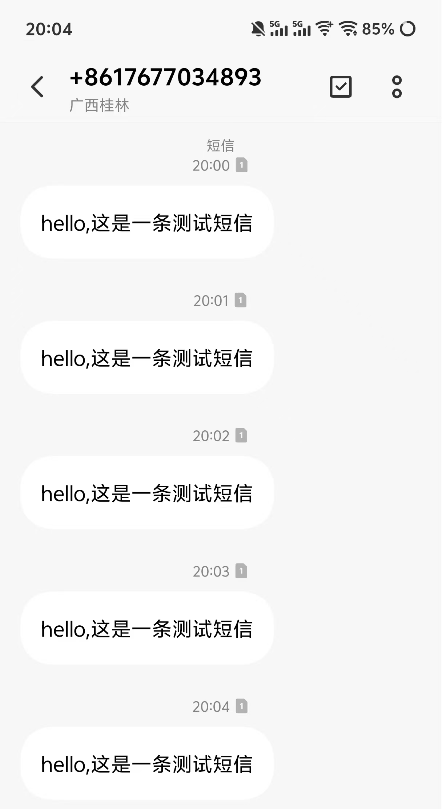
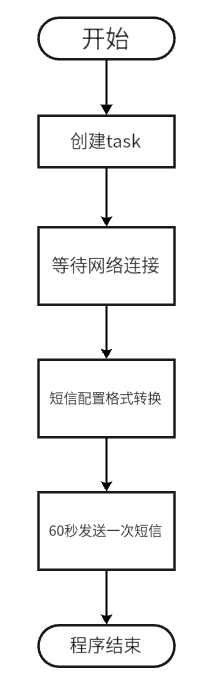

# 【EG800Z-CN】发送短信示例

### 项目概述

这是一个基础的SMS协议应用，本案例使用移远通信EG800Z-CN开发板和UniRTOS，通过调用UniRTOS中SMS相关功能函数，让开发板能向其他SIM卡发送短信，实现远程通知功能。

### 功能特性

**远程短信告警**

- **精准消息投递**：可将预设的告警或通知信息，以短信形式精准发送至指定手机号码。
- **多场景触发支持**：可集成于各类事件处理流程中（如异常检测、定时任务、用户指令），作为关键信息的远程通知出口。

### 开发准备

#### 硬件要求

- EG800Z-CN开发板，[点此购买开发板](https://www.quecmall.com/goods-detail/2c90800b987f06090198aca7bde100a6)

​	

- USB数据线（TYPE-C），[点此购买](https://detail.tmall.com/item.htm?abbucket=11&id=712043397690&mi_id=0000UuATUkl2Swill--d8ar3-R828dAfvrmApTj3VzPdxhA&ns=1&priceTId=214783fc17750971433067563e1379&skuId=5825460040081&spm=a21n57.1.hoverItem.4&utparam={"aplus_abtest"%3A"d39c694c59ac1c7b55f24ab87fd2bb30"}&xxc=taobaoSearch)

​	

- 有效SIM卡（可发短信）

​	

#### 软件要求

- Quectel USB驱动，[点此获取](https://www.quectel.com.cn/download/quectel_windows_usb_drivery_v1-0_cn)
- UniRTOS SDK，获取请联系[技术与支持](https://www.quectel.com.cn/contact?tab=t)。
- EPAT工具：移芯平台日志调试工具，[点此获取](https://www.quectel.com.cn/download/epat日志工具)

### 快速上手

#### 下载项目

示例代码位于本案例`src`目录下

#### 添加项目到UniRTOS SDK

CSDK新增Demo，固件编译和烧录请参考UniRTOS板块的**快速启动栏**

#### 硬件连接

​	

1. 按卡槽丝印提示方向拨开卡槽盖，将SIM卡放入，再扣好盖子
2. 使用数据线连接开发板和电脑

#### 效果展示

下图为手机收到开发板发来的短信

​	

### 代码概览

#### 示例流程图

​	

#### 主要功能接口

##### unir_test_demo_init

**功能**：短信发送 Demo 入口与初始化函数。负责创建独立任务，让短信发送逻辑在后台运行，不阻塞主程序。

**关键操作**：

- 任务创建：调用 **qosa_task_create** 创建名为test demo的任务，执行unir_test_demo_process主逻辑。
- 任务参数：配置栈大小 4096、普通优先级，确保短信任务稳定运行。
- **重要性**：用户应用初始化时必须调用，用于启动整个短信发送功能。

##### unir_test_demo_process

**功能**：短信发送 Demo 主处理函数。在无限循环中按固定周期执行短信发送，是业务逻辑的核心入口。
**关键操作**：

- 周期控制：延时计数，**每 60 秒触发一次短信发送**。
- 调用发送：执行qosa_sms_demo_send_all_characters_sms向目标号码发送中英混合短信。
- 状态打印：输出运行日志，标记发送成功 / 失败状态。
- 循环执行：持续运行，支持周期性自动重发。
- **重要性**：封装定时发送逻辑。

##### qosa_sms_demo_send_all_characters_sms

**功能**：中英混合短信发送核心接口。完成网络附着、编码转换、PDU 封装、异步发送全流程。
**关键操作**：

- 网络等待：调用qosa_datacall_wait_attached等待网络注册成功，超时 300s。
- 编码转换：将 UTF-8 中英文内容转为 **UCS2 编码**，支持中文正常发送。
- PDU 封装：调用qosa_sms_text_to_pdu把文本转为短信 PDU 格式。
- 异步发送：通过 qosa_sms_send_pdu_async发送短信，绑定结果回调。
- 资源释放：自动释放内存，避免泄漏。
- **重要性**：底层核心发送接口，支持中英文混合短信，可直接在项目中复用。

### 常见问题

#### 程序一直等待网络连接？

确认使用的SIM卡能够注网且正确安装